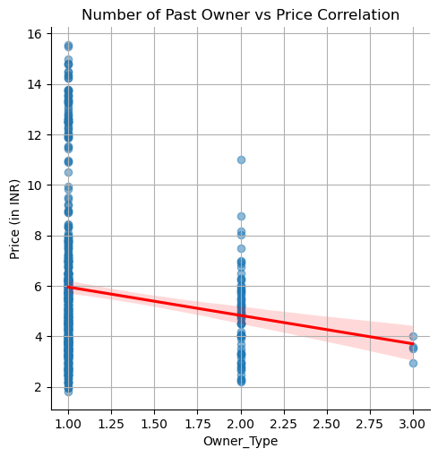

## About the project

This project aims to build a machine learning model that predicts the selling prices of used Hyundai cars in India. By analyzing historical data, we help sellers and buyers make informed decisions based on car features like year, model, mileage, and fuel type, transmission, Location, Owner-type, year and kIlometers_driven

##  Dataset

The dataset was sourced from Kaggle and includes information on 600+ used Hyundai cars, with features such as:

- Make and model of the car
- Location or city of sale
- Year of manufacture
- Mileage
- Odometer (kilometers driven)
- Fuel type (petrol or diesel)
- Transmission type (manual or automatic)
- Number of owners
- Engine displacement
- Engine horsepower
- Number of seats
- Price when the car was new

## Research

Research was carried out, to know:
- the best features to use when building a car prediction model.

## Exploratory Data Analysis (EDA)

- Visualizations were used to identify outliers.
- After the outliers were removed, scatter plots were used to see the correlation between features and price, some features like, kilometer_driven, owner_type had a negative correlation, indicating that the higher their values, the lower the price, showing in the model equation.
- A line of best fit was also used to show the the direction of correlation in scatter plot.

## Modelling

We chose Linear Regression as a baseline model due to its simplicity, interpretability, and speed. It allows us to easily understand how each feature (e.g., mileage, year, fuel type) influences the predicted price. Linear regression is also fast to train and provides a strong reference point for comparing more complex models later. Given the structured nature of the dataset, it serves as an effective and transparent starting point for car price prediction.

## Interactive Dashboard

We make use of an interactive dashboard, making it easy for users to get the predicted price for sahyundai car based on several features like Car Name, Year, Location, Milieage, Fuel_Type, Transmission, Kilometers_Driven.

## Conclusion
The Used Hyundai Cars Price Prediction Model was an intresting project, worked alongside with other great data scientists ! I learnt team work, good research skills, communication and the positive effect from having opinions from other data scientists/ analysts.
